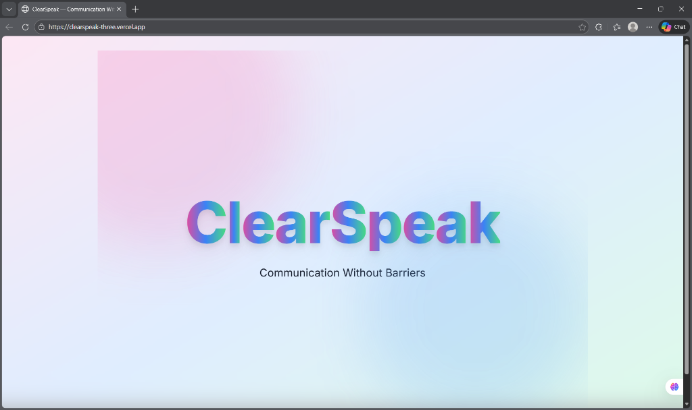
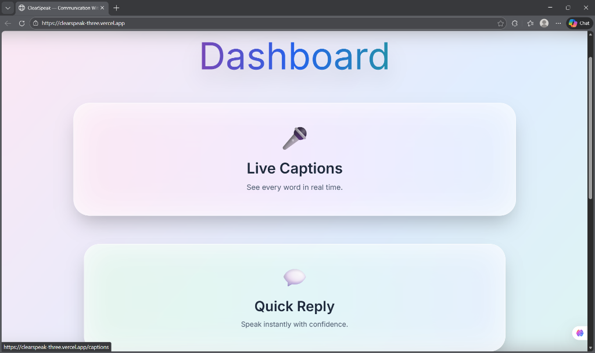
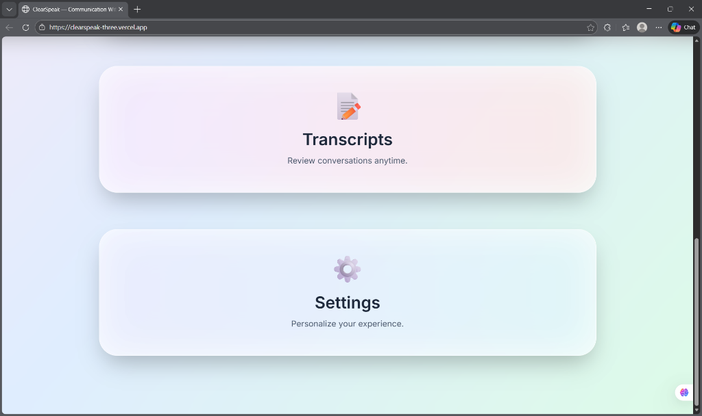
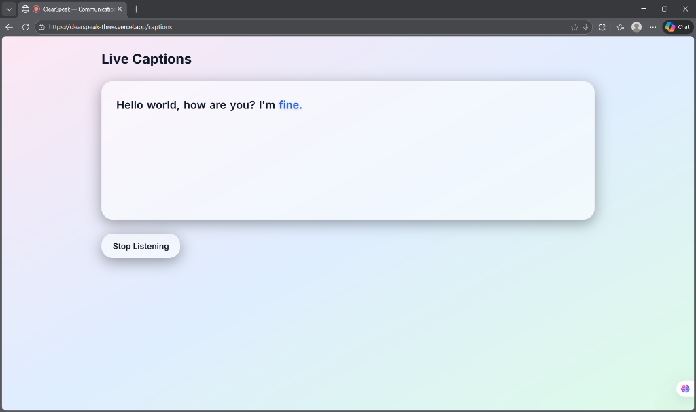
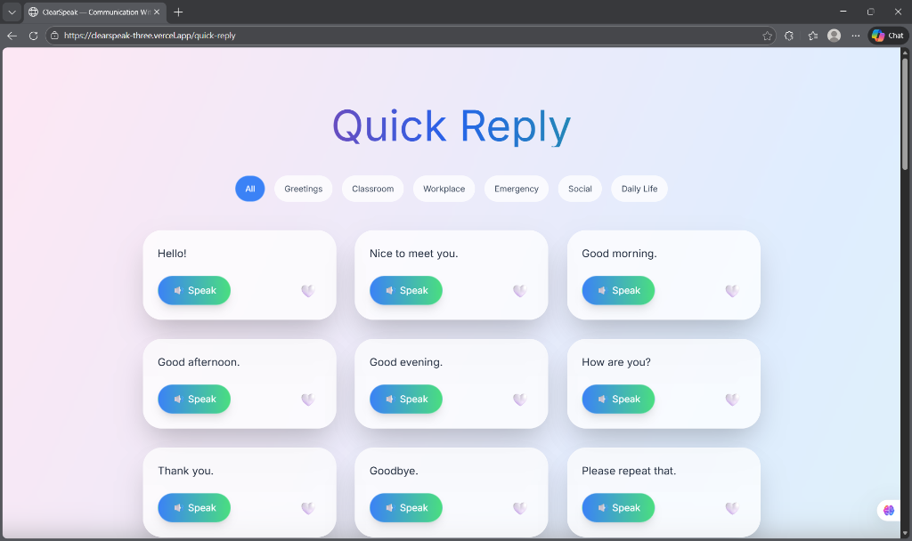
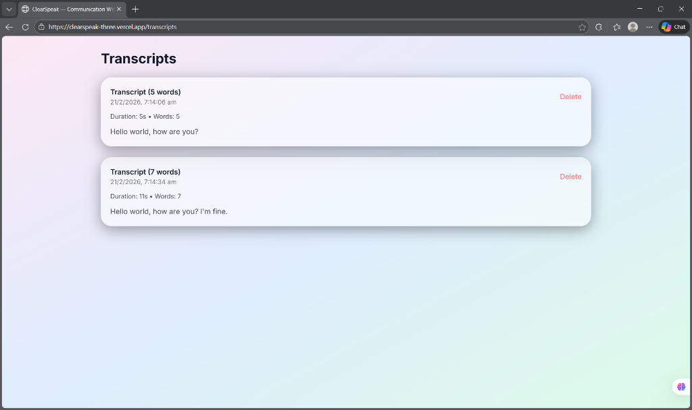
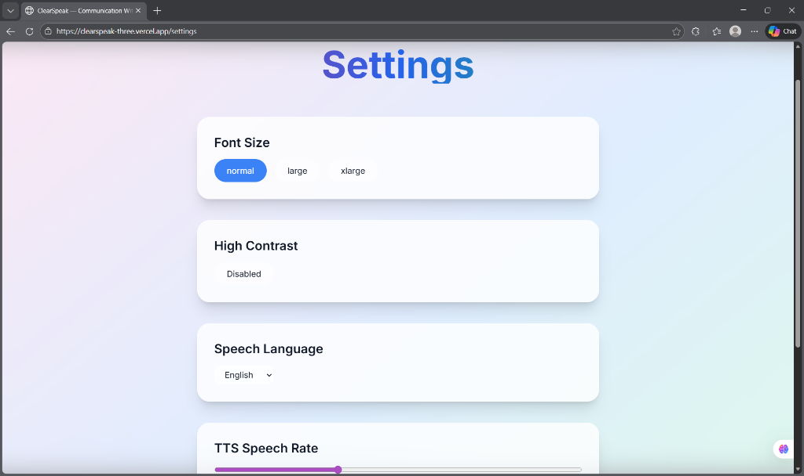

<p align="center">
  
</p>

# ClearSpeak 🎤

## Basic Details

### Team Name: ClearSpeak

### Team Members
- Member 1: Joffy Maria Pius - Developer & Designer
- Member 2: Arya Vijayakumar - Support & Research

### Hosted Project Link
[clearspeak-three.vercel.app](https://clearspeak-three.vercel.app)

### Project Description
ClearSpeak is an assistive communication web app that empowers deaf and hard-of-hearing individuals with real-time live captions, instant text-to-speech quick replies, and persistent transcript storage — all running entirely in the browser with no account required.

### The Problem Statement
Deaf and hard-of-hearing individuals face daily communication barriers in classrooms, workplaces, and social settings. Existing tools are often expensive, require dedicated hardware, or lack accessibility customization — leaving many without reliable real-time communication support.

### The Solution
ClearSpeak brings together real-time speech-to-text captioning, a curated quick-reply phrase library with one-tap text-to-speech, and session transcript storage — all in a beautifully accessible, privacy-first web app that works instantly in any modern browser without installation or sign-up.

---

## Technical Details

### Technologies/Components Used

**For Software:**
- **Languages used:** TypeScript, CSS
- **Frameworks used:** Next.js 16 (App Router), React 18
- **Libraries used:** Framer Motion, Tailwind CSS, Zustand, idb (IndexedDB), Lucide React, uuid
- **Tools used:** VS Code, Git, Vercel, Web Speech API, Web Speech Synthesis API

---

## Features

- 🎤 **Live Captions:** Real-time speech-to-text with continuous listening, interim word display, and animated word-by-word rendering
- 💬 **Quick Reply:** 50+ categorized pre-built phrases (Greetings, Classroom, Workplace, Emergency, Social, Daily Life) with one-tap Text-to-Speech and favouriting
- 📝 **Transcript Storage:** All captioning sessions saved locally via IndexedDB with word count, duration, timestamps, and delete/export functionality
- ⚙️ **Accessibility Settings:** Customizable font size, high-contrast mode, TTS speech rate, language selection (EN, ES, FR, DE, HI), and sound detection toggle
- 🔒 **Privacy-First:** All data stored locally in the browser — no server, no account, no data collection

---

## Implementation

### For Software:

#### Installation
```bash
# Clone the repository
git clone https://github.com/Joffy-Maria/clearspeak.git
cd clearspeak

# Install dependencies
npm install
```

#### Run
```bash
# Start development server
npm run dev

# Build for production
npm run build

# Start production server
npm start
```

> Open [http://localhost:3000](http://localhost:3000) in **Chrome or Edge** for full Speech API support.

---

## Project Documentation

### For Software:

#### Screenshots

<div align="center">


<br/>
<br/>


<br/>
<br/>


<br/>
<br/>



</div>

#### Diagrams

**System Architecture:**

```
  User Microphone
       │
       ▼
 Web Speech API
  (useSpeechRecognition)
       │
       ├──► CaptionDisplay (real-time UI)
       │
       └──► IndexedDB (useTranscripts → idb)
                │
                └──► TranscriptsPage (history & export)

  Quick Reply Phrases (lib/phrases.ts)
       │
       └──► Web Speech Synthesis API (useTTS)
                │
                └──► Speaker / Headphones

  User Preferences (usePreferences)
       │
       └──► localStorage ──► document.documentElement (CSS classes)
```

*All data flows client-side — no backend, no network requests for user data*

**Application Workflow:**

```
User visits ClearSpeak
        │
        ▼
  Animated Intro (5s)
        │
        ▼
    Dashboard
   ┌────┬────┬────┐
   ▼    ▼    ▼    ▼
Captions Quick Transcripts Settings
         Reply
```

---

## Additional Documentation

### For Web Projects:

#### API Documentation

ClearSpeak is a **fully client-side application** with no backend API. All data operations use browser-native APIs:

| API | Usage |
|-----|-------|
| `window.SpeechRecognition` | Live speech-to-text captioning |
| `window.speechSynthesis` | Text-to-speech playback for Quick Reply |
| `IndexedDB` (via `idb`) | Persistent transcript session storage |
| `localStorage` | User preferences and favourites |

**IndexedDB Schema**

**Store:** `transcripts` — **Database:** `ClearSpeakDB v1`

```typescript
type TranscriptSession = {
  id: string        // UUID v4 — unique session identifier
  date: number      // Unix timestamp (ms) — when session was recorded
  duration: number  // Session length in seconds
  wordCount: number // Total words spoken
  content: string   // Full transcript text
}
```

---

## Project Demo

### Video
[https://drive.google.com/file/d/1pPkRTkhorOFjQnrUDdKRpla9PbMH-RFL/view?usp=drive_link]

*Demonstrates the full ClearSpeak workflow: animated intro, live captioning session, quick reply with TTS playback, transcript review, and accessibility settings.*

### Additional Demos
[Live Site → clearspeak-three.vercel.app](https://clearspeak-three.vercel.app)

---

## AI Tools Used 

**Tool Used:** ChatGPT   

**Purpose:** Development assistance and code generation
- Boilerplate component scaffolding for React/Next.js pages
- Custom hook implementations (useSpeechRecognition, useTTS, useTranscripts)
- README documentation

**Key Prompts Used:**
- "Build a useSpeechRecognition hook with continuous listening and interim results"
- "Create a glassmorphism UI component library in React with Tailwind CSS"
- "Set up IndexedDB with idb for transcript persistence in a Next.js app"

**Percentage of AI-generated code:** ~40%

**Human Contributions:**
- Full product concept, UX design, and feature planning
- Accessibility research and phrase library curation
- UI/UX visual design direction and glassmorphism aesthetic
- Integration, testing, and deployment on Vercel

---

## Team Contributions

- **Joffy Maria Pius:** Frontend development, UI/UX design, component architecture, Next.js app setup, deployment
- **Arya Vijayakumar:** Research, accessibility content curation (50+ quick reply phrases), testing and user experience feedback

---

## License

This project is licensed under the MIT License - see the [LICENSE](LICENSE) file for details.

---

Made with ❤️ at TinkerHub
